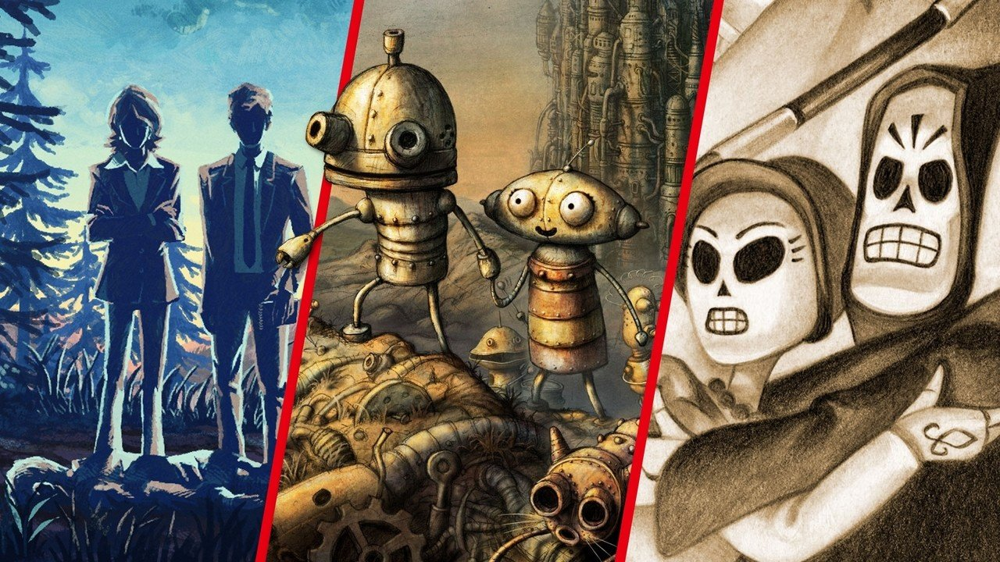

# Adventure 2.5d

Point and Click 2.5d adventure game sample with one scene.

## Features

	- 2.5d setup of the scene (3D characters, 2D backgrounds)
	- light sources and fog particle effects
	- camera follows the position of the character on the horizontal axis
	- parallax effect for background
	- player movement with left mouse and action on right mouse click
	- different footstep sounds when walking on wood or soil
	- interactable hotspots, npcs and items
	- short and very simple dialog with npc
	- simple inventory system and ability to combine items

**Unity 2019.4.26f1 LTS**

